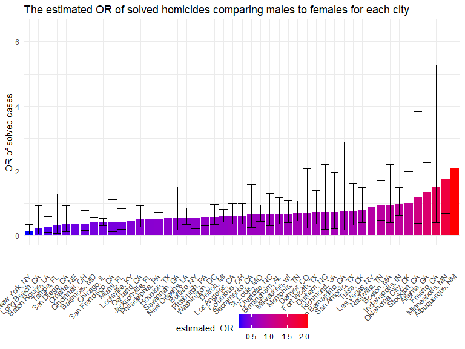
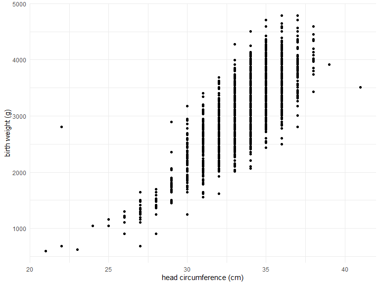
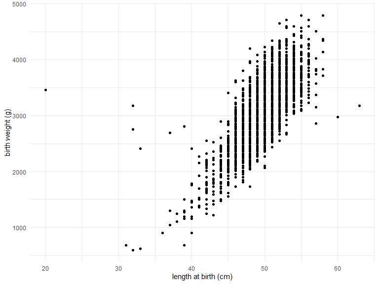
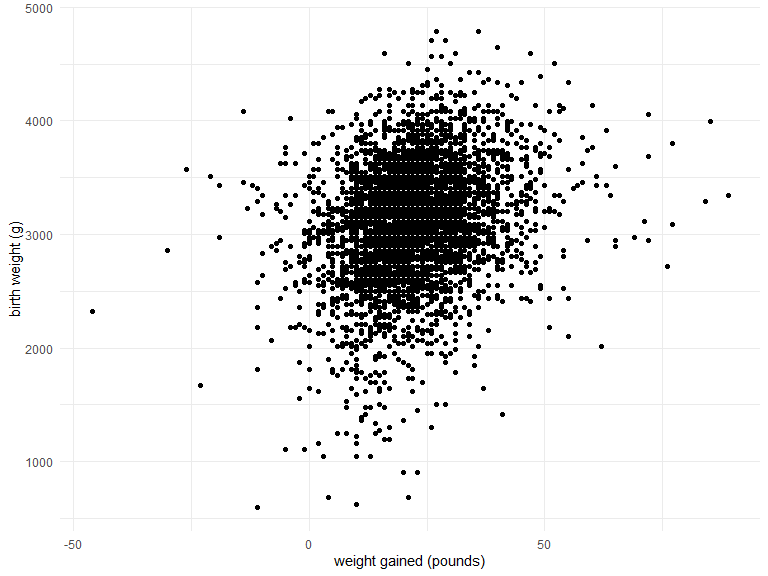
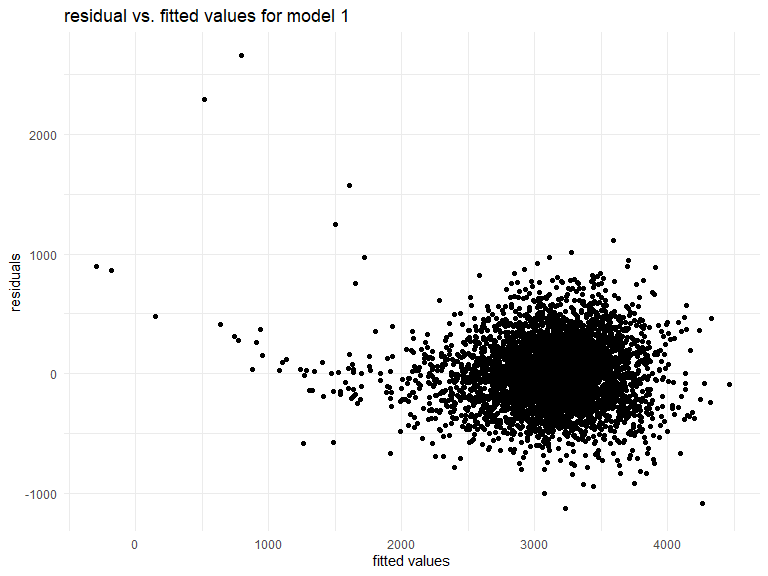

HW6
================
Xuesen Zhao
2022-11-30

``` r
library(tidyverse)
```

    ## ── Attaching packages ─────────────────────────────────────── tidyverse 1.3.2 ──
    ## ✔ ggplot2 3.3.6      ✔ purrr   0.3.4 
    ## ✔ tibble  3.1.8      ✔ dplyr   1.0.10
    ## ✔ tidyr   1.2.1      ✔ stringr 1.4.1 
    ## ✔ readr   2.1.2      ✔ forcats 0.5.2 
    ## ── Conflicts ────────────────────────────────────────── tidyverse_conflicts() ──
    ## ✖ dplyr::filter() masks stats::filter()
    ## ✖ dplyr::lag()    masks stats::lag()

``` r
library(ggridges)
library(purrr)
library(modelr)

knitr::opts_chunk$set(
    echo = TRUE,
    warning = FALSE,
    fig.width = 8, 
  fig.height = 6,
  out.width = "90%"
)

theme_set(theme_minimal() + theme(legend.position = "bottom"))

options(
  ggplot2.continuous.colour = "viridis",
  ggplot2.continuous.fill = "viridis"
)

scale_colour_discrete = scale_colour_viridis_d
scale_fill_discrete = scale_fill_viridis_d
```

## Question 1

``` r
weather_df = 
  rnoaa::meteo_pull_monitors(
    c("USW00094728"),
    var = c("PRCP", "TMIN", "TMAX"), 
    date_min = "2017-01-01",
    date_max = "2017-12-31") %>%
  mutate(
    name = recode(id, USW00094728 = "CentralPark_NY"),
    tmin = tmin / 10,
    tmax = tmax / 10) %>%
  select(name, id, everything())
```

    ## Registered S3 method overwritten by 'hoardr':
    ##   method           from
    ##   print.cache_info httr

    ## using cached file: C:\Users\david\AppData\Local/Cache/R/noaa_ghcnd/USW00094728.dly

    ## date created (size, mb): 2022-09-29 13:31:23 (8.418)

    ## file min/max dates: 1869-01-01 / 2022-09-30

## Question 2

``` r
homicides = read_csv("./data/homicide_data.csv") %>%
  janitor::clean_names() 
```

    ## Rows: 52179 Columns: 12
    ## ── Column specification ────────────────────────────────────────────────────────
    ## Delimiter: ","
    ## chr (9): uid, victim_last, victim_first, victim_race, victim_age, victim_sex...
    ## dbl (3): reported_date, lat, lon
    ## 
    ## ℹ Use `spec()` to retrieve the full column specification for this data.
    ## ℹ Specify the column types or set `show_col_types = FALSE` to quiet this message.

The raw data was collected by Washington Post on over 52,000 criminal
homicides over the past decade in 50 of the largest cities in the U.S.
The original data set contained 52179 rows and 12 columns. The features
included the case id, reported date, the first and last name of the
victim, as well as the race, age, and gender of the victim. It also
contained variables that describe the location of homicides, and the
disposition.

``` r
homicides_new = homicides %>%
  mutate(
    city_state = str_c(city,", ",state),
    solved_or_not = as.numeric(disposition == "Closed by arrest"),
    victim_age = as.numeric(victim_age)
  ) %>%
  filter(
    city_state != c("Dallas, TX", "Phoenix, AZ", "Kansas City, MO", "Tulsa, AL"),
    victim_race == c("White", "Black"), 
    ) 
```

To limit the scope of analysis for this problem, we excluded the cities
Dallas, TX; Phoenix, AZ; and Kansas City, MO which do not report victim
race. Tulsa, AL was also excluded because it was very likely a data
entry error. A binary variable “solved_or_not” was created: cases that
are “closed by arrest” were categorized as “resolved”, while cases that
are either “closed without arrest” or “open/no arrest” were categorized
as “unresolved”. Here, we only considered White or Black victim race
because other races only accounted for a very small proportion of the
data.

``` r
homicides_new %>%
  filter(city_state == "Baltimore, MD") %>%
  glm(solved_or_not ~ victim_age + victim_race + victim_sex, data = ., family = binomial() ) %>%
  broom::tidy(conf.int =TRUE) %>%
  mutate(
    estimated_OR = exp(estimate),
    CI_lower = exp(conf.low),
    CI_higher = exp(conf.high)
    ) %>%
  filter(term == "victim_sexMale") %>%
  select(term, estimated_OR, p.value, CI_lower, CI_higher) %>%
  knitr::kable(digits = 3)
```

| term           | estimated_OR | p.value | CI_lower | CI_higher |
|:---------------|-------------:|--------:|---------:|----------:|
| victim_sexMale |        0.391 |       0 |    0.265 |     0.572 |

While keeping all other variables fixed, the odds of resolved cases for
males is 2.561 times the odds of resolved cases for female. We are 95%
confident that the true odds ratio of resolved cases for male vs. female
is between 1.747 and 3.771.

``` r
homicides_new %>%
  nest(each_city = -city_state) %>%
  mutate(
   glm = map(.x = each_city, ~glm(solved_or_not ~ victim_age + victim_race + victim_sex, data =., family = binomial)),
   result = map(.x = glm, ~broom::tidy(.x, conf.int = TRUE,))
  ) %>%
  unnest(result) %>%
  filter(term == "victim_sexMale") %>%
  mutate(
    estimated_OR = exp(estimate),
    CI_lower = exp(conf.low),
    CI_higher = exp(conf.high)
    ) %>%
  select(city_state, term, estimated_OR, CI_lower, CI_higher, p.value) %>%
  knitr::kable(digits = 3)
```

| city_state         | term           | estimated_OR | CI_lower | CI_higher | p.value |
|:-------------------|:---------------|-------------:|---------:|----------:|--------:|
| Albuquerque, NM    | victim_sexMale |        2.088 |    0.693 |     6.359 |   0.188 |
| Atlanta, GA        | victim_sexMale |        1.344 |    0.797 |     2.248 |   0.262 |
| Baltimore, MD      | victim_sexMale |        0.391 |    0.265 |     0.572 |   0.000 |
| Baton Rouge, LA    | victim_sexMale |        0.253 |    0.096 |     0.593 |   0.003 |
| Birmingham, AL     | victim_sexMale |        0.666 |    0.367 |     1.184 |   0.172 |
| Boston, MA         | victim_sexMale |        0.934 |    0.401 |     2.199 |   0.874 |
| Buffalo, NY        | victim_sexMale |        0.548 |    0.208 |     1.414 |   0.212 |
| Charlotte, NC      | victim_sexMale |        0.654 |    0.311 |     1.294 |   0.239 |
| Chicago, IL        | victim_sexMale |        0.397 |    0.301 |     0.525 |   0.000 |
| Cincinnati, OH     | victim_sexMale |        0.364 |    0.157 |     0.774 |   0.012 |
| Columbus, OH       | victim_sexMale |        0.609 |    0.363 |     1.005 |   0.055 |
| Denver, CO         | victim_sexMale |        0.704 |    0.231 |     2.073 |   0.526 |
| Detroit, MI        | victim_sexMale |        0.579 |    0.415 |     0.805 |   0.001 |
| Durham, NC         | victim_sexMale |        0.710 |    0.199 |     2.207 |   0.570 |
| Fort Worth, TX     | victim_sexMale |        0.709 |    0.353 |     1.395 |   0.324 |
| Fresno, CA         | victim_sexMale |        1.509 |    0.407 |     5.281 |   0.520 |
| Houston, TX        | victim_sexMale |        0.529 |    0.370 |     0.750 |   0.000 |
| Indianapolis, IN   | victim_sexMale |        0.960 |    0.621 |     1.476 |   0.852 |
| Jacksonville, FL   | victim_sexMale |        0.497 |    0.321 |     0.761 |   0.001 |
| Las Vegas, NV      | victim_sexMale |        0.868 |    0.540 |     1.379 |   0.552 |
| Long Beach, CA     | victim_sexMale |        0.230 |    0.034 |     0.928 |   0.067 |
| Los Angeles, CA    | victim_sexMale |        0.604 |    0.363 |     0.996 |   0.050 |
| Louisville, KY     | victim_sexMale |        0.453 |    0.221 |     0.887 |   0.024 |
| Memphis, TN        | victim_sexMale |        0.704 |    0.448 |     1.081 |   0.117 |
| Miami, FL          | victim_sexMale |        0.410 |    0.199 |     0.834 |   0.014 |
| Milwaukee, wI      | victim_sexMale |        0.668 |    0.398 |     1.096 |   0.117 |
| Minneapolis, MN    | victim_sexMale |        1.731 |    0.677 |     4.647 |   0.259 |
| Nashville, TN      | victim_sexMale |        0.918 |    0.479 |     1.706 |   0.790 |
| New Orleans, LA    | victim_sexMale |        0.537 |    0.340 |     0.848 |   0.007 |
| New York, NY       | victim_sexMale |        0.126 |    0.036 |     0.340 |   0.000 |
| Oakland, CA        | victim_sexMale |        0.494 |    0.264 |     0.915 |   0.026 |
| Oklahoma City, OK  | victim_sexMale |        0.999 |    0.506 |     1.966 |   0.998 |
| Omaha, NE          | victim_sexMale |        0.353 |    0.139 |     0.846 |   0.023 |
| Philadelphia, PA   | victim_sexMale |        0.507 |    0.352 |     0.722 |   0.000 |
| Pittsburgh, PA     | victim_sexMale |        0.574 |    0.302 |     1.077 |   0.086 |
| Richmond, VA       | victim_sexMale |        0.712 |    0.219 |     1.963 |   0.535 |
| San Antonio, TX    | victim_sexMale |        0.744 |    0.331 |     1.617 |   0.462 |
| Sacramento, CA     | victim_sexMale |        0.638 |    0.246 |     1.572 |   0.338 |
| Savannah, GA       | victim_sexMale |        0.536 |    0.180 |     1.499 |   0.243 |
| San Bernardino, CA | victim_sexMale |        0.728 |    0.179 |     2.889 |   0.647 |
| San Diego, CA      | victim_sexMale |        0.353 |    0.118 |     0.921 |   0.043 |
| San Francisco, CA  | victim_sexMale |        0.403 |    0.125 |     1.111 |   0.096 |
| St. Louis, MO      | victim_sexMale |        0.641 |    0.437 |     0.936 |   0.022 |
| Stockton, CA       | victim_sexMale |        1.180 |    0.374 |     3.832 |   0.778 |
| Tampa, FL          | victim_sexMale |        0.315 |    0.061 |     1.284 |   0.124 |
| Tulsa, OK          | victim_sexMale |        0.776 |    0.391 |     1.489 |   0.456 |
| Washington, DC     | victim_sexMale |        0.576 |    0.336 |     0.966 |   0.040 |

``` r
homicides_new %>%
  nest(each_city = -city_state) %>%
  mutate(
   glm = map(.x = each_city, ~glm(solved_or_not ~ victim_age + victim_race + victim_sex, data =., family = binomial)),
   result = map(.x = glm, ~broom::tidy(.x, conf.int = TRUE,))
  ) %>%
  unnest(result) %>%
  filter(term == "victim_sexMale") %>%
  mutate(
    estimated_OR = exp(estimate),
    CI_lower = exp(conf.low),
    CI_higher = exp(conf.high)
    ) %>%
  select(city_state, term, estimated_OR, CI_lower, CI_higher, p.value) %>%
  ggplot(data = ., aes(x = reorder(city_state,+estimated_OR), y = estimated_OR, fill = estimated_OR))+geom_bar(stat="identity")+geom_errorbar(aes(ymin = CI_lower, ymax=CI_higher))+labs(title = "The estimated OR of solved homicides comparing males to females for each city", x = NULL, y = "OR of solved cases")+scale_fill_gradient(low="blue",high="red")+theme(axis.text.x = element_text(angle = 45, vjust = 0.5, hjust=1))
```



As shown above, the odds of solved cases for males victims is generally
higher in all cities in our sample compared to the odds of solved
homicides for female victims. The odds ratio of solved homicides for
males compared to females is highest in Albuquerque, NM: the odds of
solved homicides for male victims is about twice the odds of resolved
homicides for female victims, while holding all other variables fixed.
In contrast, the odds ratio of solved cases between the two sexes is
about 0 in New York, NY, while holding all other variables fixed.

## Question 3

``` r
birthweight = read_csv("./data/birthweight.csv") %>%
  janitor::clean_names() %>%
  drop_na() %>%
  mutate(
    babysex = as.factor(babysex),
    frace = as.factor(frace),
    malform = as.factor(malform),
    mrace = as.factor(mrace)
  )
```

    ## Rows: 4342 Columns: 20
    ## ── Column specification ────────────────────────────────────────────────────────
    ## Delimiter: ","
    ## dbl (20): babysex, bhead, blength, bwt, delwt, fincome, frace, gaweeks, malf...
    ## 
    ## ℹ Use `spec()` to retrieve the full column specification for this data.
    ## ℹ Specify the column types or set `show_col_types = FALSE` to quiet this message.

The head circumference of the newborns and length of the baby may be
correlated with the baby’s birth weight. In addition, certain variables
such as weight gain since pregnancy could be indicative of maternal
health and correlated with the birth weight of the baby. The following
graphs showed that a linear relationship exist between the three
independent variables and the response variable.

``` r
birthweight %>%
  ggplot(aes(x=bhead, y = bwt))+geom_point()+labs(x = "head circumference (cm)", y = "birth weight (g)")
```



``` r
birthweight %>%
  ggplot(aes(x=blength, y = bwt))+geom_point()+labs(x = "length at birth (cm)", y = "birth weight (g)")
```



``` r
birthweight %>%
  ggplot(aes(x=wtgain, y = bwt))+geom_point()+labs(x = "weight gained (pounds)", y = "birth weight (g)")
```



The first hypothesized model lm1 is :
$bwt = \beta_0+\beta_1bhead+\beta_2blength+\beta_3wtgain$

``` r
lm1 = birthweight %>%
  lm(bwt ~ bhead + blength + wtgain, data = .) 
birthweight %>%
  modelr::add_residuals(lm1) %>%
  modelr::add_predictions(lm1) %>%
  ggplot(aes(x = pred, y = resid)) + geom_point()+labs(title = "residual vs. fitted values for model 1", x = "fitted values", y = "residuals")
```



Next, two additional models were generated and compared to our
hypothesized model. Model 2 involved length at birth and gestational age
as predictors, and model 3 used head circumference, length, sex, and all
interactions (including the three-way interaction) between these as the
predictors.

``` r
cv_df =
  crossv_mc(birthweight, 100) %>% 
  mutate(
    train = map(train, as_tibble),
    test = map(test, as_tibble)) %>%
  mutate(
    lm1 = map(train, ~lm(bwt ~ bhead + blength + wtgain, data = .x)),
    lm2 = map(train, ~lm(bwt ~ blength + gaweeks, data = .x)), 
    lm3 = map(train, ~lm(bwt ~ bhead+ blength + babysex + bhead*blength + bhead*babysex + blength*babysex + bhead*blength*babysex, data = .x))
  ) %>%
  mutate(
    rmse_lm1 = map2_dbl(lm1, test, ~rmse(model = .x, data = .y)),
    rmse_lm2    = map2_dbl(lm2, test, ~rmse(model = .x, data = .y)),
    rmse_lm3 = map2_dbl(lm3, test, ~rmse(model = .x, data = .y))
    )
```

``` r
cv_df %>% 
  select(starts_with("rmse")) %>% 
  pivot_longer(
    everything(),
    names_to = "model", 
    values_to = "rmse",
    names_prefix = "rmse_") %>% 
  mutate(model = fct_inorder(model)) %>% 
  ggplot(aes(x = model, y = rmse)) + geom_violin()
```


As shown above, the first and third model may be better models because
they have lower RMSE values. Model 1 is preferred because it’s more
simple than model 3 and it has a slightly lower RMSE value.
